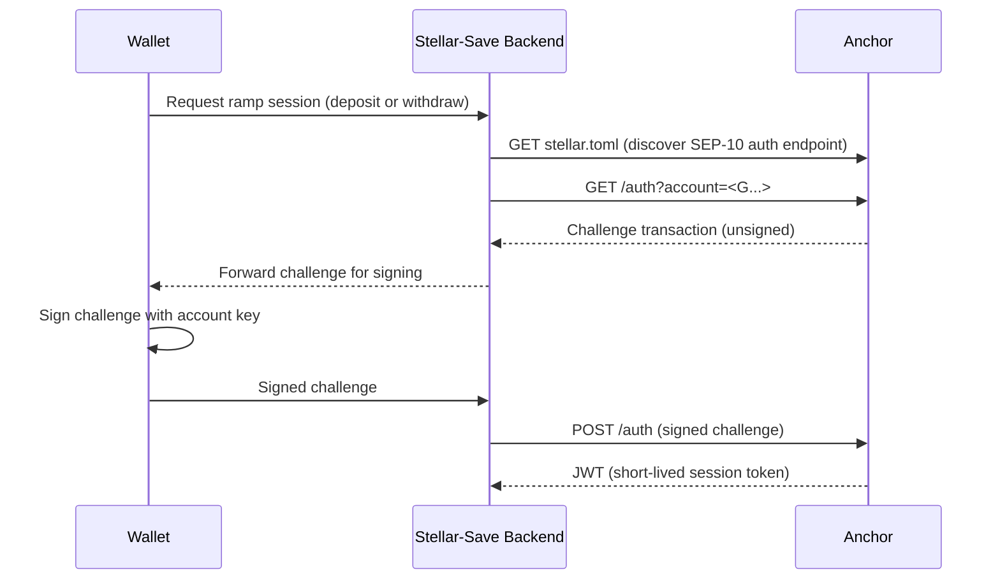
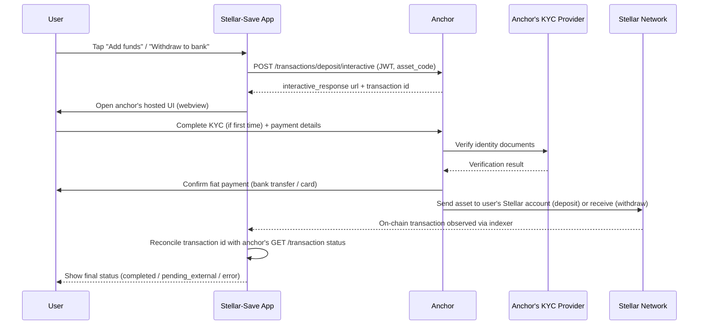
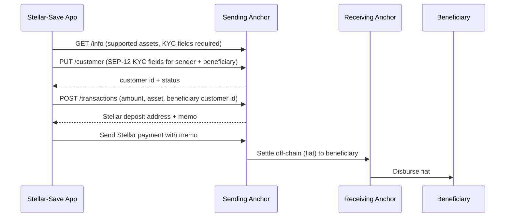

# Fiat On/Off-Ramp Integration & Compliance Flow

Stellar-Save's fiat on/off-ramp (buy XLM/stablecoins with fiat, withdraw payouts to a bank
account) is planned for [v4.0 on the roadmap](roadmap.md#v40--mobile-app--fiat-onoff-ramps).
This document specifies how the integration uses the Stellar Ecosystem Proposals (SEPs) for
anchor interoperability, where KYC data lives, and what to do when a ramp incident occurs.

For the legal/regulatory backdrop (money transmission, GDPR, jurisdiction-specific
obligations), see [legal-compliance.md](legal-compliance.md) — this document covers the
technical flow and operational responsibilities, not legal interpretation.

---

## 1. Roles and Trust Assumptions

| Party | Role | Trust assumption |
|---|---|---|
| **Stellar-Save backend** | Initiates ramp sessions, stores only the anchor-issued transaction reference (no PII) | Trusted by the user to route them to a legitimate anchor; never sees raw KYC documents |
| **Anchor (SEP-24/31 provider)** | Hosts the deposit/withdraw UI, performs custody of fiat, settles on-chain via Stellar | Partially trusted third party — selected from `stellar.toml` `TRANSFER_SERVER` / `TRANSFER_SERVER_SEP0031` entries; must be a vetted, licensed money transmitter |
| **KYC provider** | Collects and verifies identity documents on the anchor's behalf (often the anchor itself, or a sub-processor) | Holds all PII; Stellar-Save has no direct integration with this provider |
| **User's wallet** | Signs the Stellar transaction that moves funds to/from the anchor's escrow account | Standard non-custodial trust model, same as in-app contributions |

Stellar-Save **never holds fiat or KYC documents**. Its only responsibility is to discover
the anchor via SEP-1, hand off to the anchor's hosted flow, and reconcile the resulting
on-chain transaction with the user's account.

---

## 2. SEP-10 — Authentication

Before any ramp interaction, the wallet authenticates to the anchor using SEP-10
(Stellar Web Authentication) so the anchor can issue a session JWT scoped to that account.

The JWT is passed through to the client and used for the SEP-24/31 calls below. The backend
does not persist the JWT beyond the active session.

---

## 3. SEP-24 — Interactive On/Off-Ramp (deposit & withdraw)

SEP-24 is used for the consumer-facing flow: the anchor hosts its own KYC + payment UI in a
webview/popup, so Stellar-Save never touches payment details.

Stellar-Save polls `GET /transaction?id=<id>` (or subscribes to the anchor's webhook, if
offered) purely to reflect status in the UI. The anchor's `kyc_status`, document data, and
payment instrument details are never returned to or stored by Stellar-Save — only the
`status`, `amount_in`/`amount_out`, and `stellar_transaction_id` fields are read.

---

## 4. SEP-31 — Direct Cross-Border Payout (optional, sending-side use)

SEP-31 is relevant if Stellar-Save ever needs to push a payout directly to a receiving
anchor on behalf of a user (e.g. cross-border payout without the user holding a wallet). It
differs from SEP-24 in that the *sending* anchor collects compliance data about the
beneficiary up front, via a `/customer` (SEP-12) call, before funds move.

As with SEP-24, all SEP-12 KYC fields are submitted directly from the client to the anchor;
Stellar-Save's backend only relays the anchor's published schema, it does not store the
submitted field values.

---

## 5. KYC Data Handling

- **Where KYC data lives**: exclusively with the anchor and its KYC provider (per §1–4
  above). Stellar-Save's backend and database have no table, column, or log line containing
  identity documents, selfies, SSNs, or bank account numbers.
- **What Stellar-Save does store**: the anchor's transaction `id`, `status`, `amount_in`,
  `amount_out`, `asset_code`, and the resulting Stellar `transaction_id` — needed to
  reconcile the ramp with the user's in-app balance. None of these fields are PII.
- **Logging**: application logs must never include SEP-12 field values or JWTs. If a
  SEP-24/31 request/response is logged for debugging, redact the `kyc_status` body and any
  `customer` payload before persisting.
- **Retention**: ramp transaction metadata (the non-PII fields above) follows the same
  retention policy as other transaction records — see
  [legal-compliance.md §4 Data Retention](legal-compliance.md#4-data-retention). Since no
  PII is stored, there is no separate PII retention/deletion obligation on Stellar-Save's
  side; deletion requests for identity data must be directed to the anchor/KYC provider.

---

## 6. Operator Runbook: Ramp Incidents

See [docs/runbooks/fiat-ramp-incident.md](runbooks/fiat-ramp-incident.md) for the
on-call procedure when a deposit/withdraw flow fails or an anchor is unreachable.
