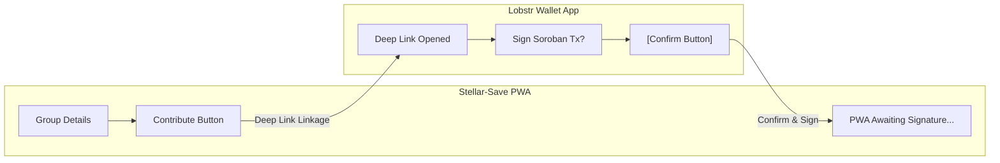

# Stellar-Save Mobile Web & PWA User Guide 🌊📱

Welcome to the **Stellar-Save Mobile User Guide**! 

Stellar-Save is a decentralized, mobile-responsive Progressive Web App (PWA). Instead of requiring a heavy app download from the Apple App Store or Google Play Store, Stellar-Save runs directly in your mobile browser and connects securely to non-custodial Stellar wallets like **Lobstr**, **Albedo**, and **xbull**.

This guide covers PWA installation, mobile wallet linking, step-by-step contribution flows, and troubleshooting common mobile errors.

---

## 🗺️ Table of Contents
1. [📥 Progressive Web App (PWA) Installation](#1-progressive-web-app-pwa-installation)
2. [💳 Connecting Your Mobile Wallet (Lobstr, etc.)](#2-connecting-your-mobile-wallet-lobstr-etc)
3. [💸 Step-by-Step Mobile Contribution Flow](#3-step-by-step-mobile-contribution-flow)
4. [🎨 Mobile UI Wireframes & Layouts](#4-mobile-ui-wireframes--layouts)
5. [🔧 Troubleshooting Mobile Transactions](#5-troubleshooting-mobile-transactions)

---

## 📥 1. Progressive Web App (PWA) Installation

Installing Stellar-Save as a PWA puts a lightweight icon on your home screen, enables fast loading, and allows the app to feel like a native mobile app without taking up device storage.

### iOS (Safari)
1. Open the **Safari** app on your iPhone or iPad.
2. Navigate to your Stellar-Save deployment URL (e.g., `https://app.stellarsave.io`).
3. Tap the **Share** button (the square icon with an arrow pointing up at the bottom navigation bar).
4. Scroll down and tap **Add to Home Screen**.
5. Give the app a name (e.g., "Stellar-Save") and tap **Add** in the top-right corner.
6. The icon will now appear on your home screen!

### Android (Chrome)
1. Open the **Google Chrome** app on your Android device.
2. Navigate to the Stellar-Save URL.
3. Tap the **three vertical dots** in the top-right corner.
4. Tap **Install app** or **Add to Home Screen**.
5. Follow the on-screen prompt to confirm installation by tapping **Install**.
6. Chrome will add the app to your home screen and app drawer automatically.

> [!NOTE]
> PWA installation is optional but highly recommended. It disables the browser address bar, giving you more screen space and smoother navigation.

---

## 💳 2. Connecting Your Mobile Wallet (Lobstr, etc.)

Stellar-Save does not store your private keys or seed phrase. All transactions are securely signed using external wallet apps. We recommend the **Lobstr mobile wallet** for the best mobile experience.

### Linking the Lobstr Mobile Wallet
1. Open the Stellar-Save PWA on your mobile home screen.
2. Tap the **Connect Wallet** button in the top header.
3. Select **Lobstr Wallet** from the list of connection options.
4. The PWA will trigger a **Stellar Wallet Link** connection:
   * **On the same device**: You will be automatically deep-linked and redirected to your Lobstr app.
   * **On a separate device**: A QR code will appear. Open the Lobstr app, tap the camera icon in the top right, and scan the QR code.
5. In the Lobstr app, you will see a prompt saying **"Connect to Stellar-Save"**.
6. Review the permissions and tap **Approve**.
7. Return to the Stellar-Save PWA. Your wallet address and XLM balance will now be visible in the header!

```
[Stellar-Save PWA] ──► Tap Connect ──► Select Lobstr ──► Deep Link/QR ──► [Lobstr App] ──► Tap Approve ──► Linked!
```

---

## 💸 3. Step-by-Step Mobile Contribution Flow

Contributing to your savings group on mobile is secure and takes under 30 seconds. Because each contribution requires transferring funds from your wallet to the smart contract, you must approve the transfer in your Lobstr app.

### Step 1: Open Your Group
1. In the Stellar-Save PWA, tap the **My Groups** tab.
2. Tap on the group card you want to contribute to (e.g., "Family Savings Pool").

### Step 2: Initiate Contribution
1. Review the required contribution amount (e.g., `50 XLM` or `10 USDC`).
2. Tap the prominent purple **Contribute** button.
3. If this is a custom token group (like USDC), the app will first request a **Token Allowance Approval**. Tap **Approve Allowance**.

### Step 3: Approve in Lobstr Wallet
1. The Stellar-Save PWA will automatically open your **Lobstr** mobile wallet via a secure deep link.
2. A **Transaction Review** screen will appear in Lobstr showing:
   * **Operation**: Invoke Host Function (Soroban Smart Contract)
   * **Contract ID**: `C...` (Stellar-Save contract)
   * **Amount**: Your contribution amount (e.g., `50 XLM`)
   * **Fee**: Network resource fee (~0.00001 XLM)
3. Authenticate using your Lobstr passcode, Face ID, or Fingerprint.
4. Tap **Confirm & Sign**. Wait 3 seconds for the transaction to be submitted to the Stellar network.

### Step 4: Confirm Success
1. Once Lobstr completes the signing, switch back to your browser or PWA.
2. A success screen will display a green checkmark animation along with your transaction receipt.
3. Pull down to refresh your group details—you will see a green checkmark next to your name for the current cycle!

> [!IMPORTANT]
> **Token Allowance:** For custom tokens like USDC, you will perform the signing flow twice: once for the `approve` transaction (granting the contract permission to pull the tokens) and once for the `contribute` transaction.

---

## 🎨 4. Mobile UI Wireframes & Layouts

Here are mock visual wireframes illustrating the mobile-responsive interface for key application screens.

### 📱 Dashboard UI Layout
The dashboard is designed for thumb-friendly interaction with prominent cards and progress indicators:

```mermaid
graph TD
    subgraph Mobile Screen (Dashboard)
        A[Header: Stellar-Save Logo & Wallet Connect]
        B["Card: Total Active Balance (500 XLM)"]
        C["Section: My Savings Groups"]
        D["Group 1: Family Pool (Progress: 80%) [Contribute Button]"]
        E["Group 2: Trade Circle (Progress: 33%) [Contribute Button]"]
        F[Footer Navigation: Home / Groups / History / Settings]
    end
    A --> B
    B --> C
    C --> D
    C --> E
    E --> F
    D --> F
```

*For a high-fidelity visual preview, see the mock image below:*


---

### 💸 Contribution Authorization Flow
This wireframe shows the transition from the PWA contribution screen to the Lobstr signing modal:



*For a high-fidelity visual preview of the Lobstr signing screen, see the mock image below:*


---

## 🔧 5. Troubleshooting Mobile Transactions

Mobile operating systems have strict background app policies. Here is how to fix common transaction errors.

### 1. Connection Dropouts / Link Fails
* **Symptom**: Tapping "Contribute" does not redirect to the Lobstr app, or the PWA gets stuck loading indefinitely.
* **Resolution**: 
  1. Ensure both your browser and the Lobstr app are updated to the latest versions.
  2. If the deep link fails to trigger, copy the Group ID, open the Lobstr in-app browser (if available), and navigate to the Stellar-Save site within Lobstr itself.
  3. Close other background apps to free up device memory.

### 2. Insufficient XLM for Transaction Fees
* **Symptom**: The Lobstr app returns an error stating `Insufficient Balance` or `Fee Payment Failed`.
* **Resolution**: Even if you are contributing custom tokens (like USDC), Stellar requires a tiny amount of native **XLM** in your wallet to pay for transaction gas fees. Always maintain at least **1–2 XLM** (under $0.20) in your wallet to cover fee overheads.

### 3. Reentrancy Block / Duplicate Click
* **Symptom**: Transaction fails with `Error Code: 5002` or `Contract Reentered`.
* **Resolution**: This occurs if you tap the "Contribute" button multiple times quickly on a laggy connection. The smart contract locks itself during a transfer to prevent reentrancy attacks. Close the app, wait 10 seconds, refresh, and tap once.

### 4. Background Sleep / Timeout
* **Symptom**: After signing in Lobstr, you return to the PWA and see a "Transaction Timeout" or "Session Expired" error.
* **Resolution**: iOS and Android will sometimes freeze background browser tabs while you are signing in another app. To prevent this, sign the transaction in Lobstr within **15 seconds** and switch back to Safari/Chrome immediately.