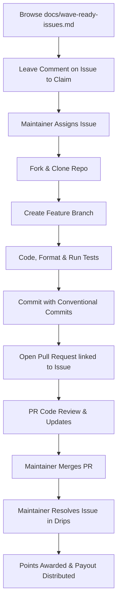

# Drips Wave Contributor Guide 🌊

Welcome to the **Stellar-Save Drips Wave Contributor Guide**! 

Stellar-Save is a decentralized, trustless, and transparent Rotational Savings and Credit Association (ROSCA) built on Stellar Soroban smart contracts. We participate in the **Drips Wave** program — an innovative developer funding initiative that rewards open-source contributors for helping us build financial inclusion tools on the Stellar blockchain.

This guide explains how you can contribute, earn points, and convert those points into funding.

---

## 🪙 1. The Points System & Funding Model

The Drips Wave program works on a **shared reward pool model** rather than a fixed exchange rate per point. This ensures fairness, collaboration, and high-quality contributions.

### Complexity & Point Tiers
Each funded issue in our repository is categorized into three difficulty tiers, each carrying a fixed point reward upon completion:

| Tier | Points | Scope & Examples |
| :--- | :--- | :--- |
| **`trivial`** | **100 Points** | Documentation improvements, minor copy/UI adjustments, simple unit tests, helper methods. |
| **`medium`** | **150 Points** | Core helper functions, state-validation logic, and medium-complexity features (includes a 50-point complexity bonus). |
| **`high`** | **200 Points** | Major smart contract enhancements, complex integrations (e.g., SEP-41 tokens), security additions, and rich frontend dashboards. |

### How Points Convert to Funding (USDC)
Points act as **shares in the total reward budget** allocated for each active Wave cycle. Your final payout is determined dynamically at the end of the Wave using the following formula:

$$\text{Your Payout} = \left( \frac{\text{Your Earned Points}}{\text{Total Points Earned by All Contributors}} \right) \times \text{Total Wave Reward Budget}$$

> [!NOTE]
> The dollar (USDC) value of a single point is dynamic. If fewer contributors participate, the value per point increases; if the wave is highly active, it remains proportional to the value of your output.

> [!IMPORTANT]
> **KYC Requirement:** To claim and withdraw your earned USDC rewards at the end of a Wave cycle, you **must** complete identity verification (KYC) through the Drips Wave app.

---

## 🛠️ 2. End-to-End Contribution Process

Follow this workflow to ensure your contribution is tracked, reviewed, and awarded points successfully:



### Step 1: Find and Claim an Issue
1. Browse open issues on [GitHub Issues](https://github.com/Xoulomon/Stellar-Save/issues) labeled `wave-ready` or refer to [docs/wave-ready-issues.md](wave-ready-issues.md).
2. Leave a comment expressing your intent to work on the issue (e.g., *"I would like to claim this issue!"*). 
3. Wait for a project maintainer to officially assign you to the issue. This avoids duplicated effort.

### Step 2: Set Up and Branch
1. Fork the [Stellar-Save repository](https://github.com/Xoulomon/Stellar-Save) and clone it locally.
2. Create a clean branch from `main` using standard naming conventions:
   ```bash
   git checkout -b feat/issue-title   # For features
   git checkout -b fix/issue-title    # For bug fixes
   git checkout -b docs/issue-title   # For documentation
   git checkout -b test/issue-title   # For tests
   ```

### Step 3: Develop, Format, and Test
Maintain high standards of code quality. Before submitting, always ensure that formatting and tests are green:

* **For Rust Smart Contracts:**
  ```bash
  cargo fmt                       # Enforces format standards
  cargo clippy -- -D warnings     # Catch lints & errors
  cargo test -p stellar-save      # Run contract tests
  ```
* **For TypeScript React Frontend:**
  ```bash
  cd frontend
  npm run lint                    # Runs ESLint rules
  npm test run                    # Executes component and hook tests
  ```

### Step 4: Commit and Link
1. Use **Conventional Commits** (e.g., `feat(contract): add validation check`). The repository has Husky hooks that validate commit message formatting automatically.
2. Open a Pull Request (PR) from your fork to `Xoulomon/Stellar-Save:main`.
3. **CRITICAL:** Link the PR to the issue by adding the closing keyword in the description:
   ```markdown
   Closes #<issue_number>
   ```
   *If the PR is not properly linked to the issue, the automated Drips tracking system will not register your contribution.*

### Step 5: Review, Merge, and Award
1. A maintainer will review your code. Address any requested changes promptly by pushing new commits to your branch.
2. Once approved, the maintainer will merge your PR.
3. The maintainer will mark the associated issue as **"Resolved"** in the Drips Wave dashboard, which instantly credits the point value to your contributor profile!

> [!TIP]
> **Maintainer SLA:** If your PR has been merged but your points have not been credited, or if a maintainer has been unresponsive for more than 24 hours on a review, open a support ticket in the **Drips Discord** for automated resolution.

---

## 🎯 3. Active Wave-Ready Issues

The following issues are currently open and ready to be claimed for the active Wave. For an exhaustive breakdown and task lists, see [docs/wave-ready-issues.md](wave-ready-issues.md).

* **`validate-max-members` Property Tests** (`medium`, 150 pts)
* **`get-current-timestamp` Property Tests** (`trivial`, 100 pts)
* **`calculate-current-cycle` Property Tests** (`medium`, 150 pts)
* **`comprehensive-input-validation` Property Tests** (`high`, 200 pts)
* **Group Analytics Page & Recharts Graph** (`high`, 200 pts)
* **Multi-Token Integration Test Suite** (`high`, 200 pts)

---

## 🙋 4. Getting Support

Need help getting started or got stuck on a Soroban smart contract error?
* **Discussions:** [GitHub Discussions](https://github.com/Xoulomon/Stellar-Save/discussions)
* **Telegram:** [@Xoulomon](https://t.me/Xoulomon)
* **Discord:** Drips Wave Contributor Support

Thank you for dedicating your time to public goods funding on Stellar! 🚀
